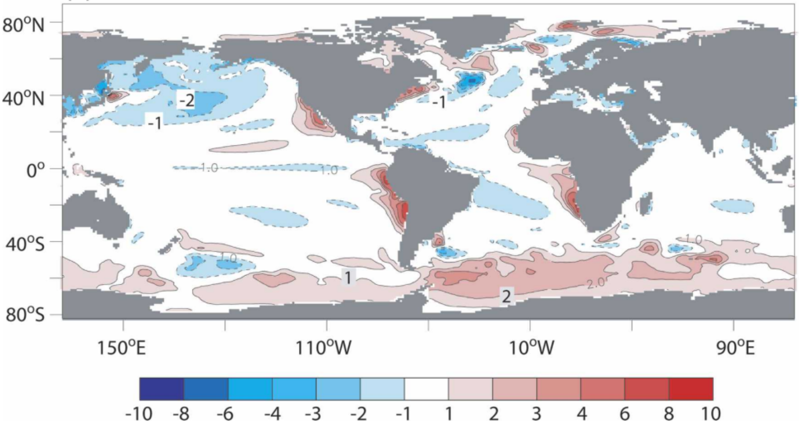

# 2.相关研究内容

### 2.1 GFDL CM模式

气候模式是用于提高人们对各种时间尺度（季节，年度，年代等）气候现象的理解和可预测性的重要工具，其预测结果能为人们各类决策提供必要的信息，如水资源管理，农业，交通和城市规划。其中，GFDL CM是由美国国家海洋大气管理局地球流体动力学实验室(Geophysical Fluid Dynamics Laboratory）开发的一个全球海-气耦合环流模式，其始于20世纪60年代，经过50余年的发展，目前已经在气候变化、 热带气旋等的研究中得到广泛的应用,其已被实验证明在ENSO事件可预报性问题中中具有较高的可信度[7],这也是本文选取其作为运行模式的原因。

本文所采用的模式版本为GFDL CM2.1，该模式共由大气，海洋，陆地和海冰四个子模式组成，其中主要最重要的两个子模式为大气模式和海洋模式，下面分别介绍这两个子模式。

#### 2.1.1 大气模式

GFDL CM2.1大气模式垂直方向上共24层，其水平分辨率2°*2.5°。利用时间步长为3小时的大气辐射和时间步长为0.5小时的其他大气物理时间步长，并包括日照循环。该分辨率足以解决产生天气变化的大中型气旋等问题。

#### 2.1.2 海洋模式

GFDL CM2.1海洋模式垂直方向上共50层，其水平分辨率在经度方向为1°，在纬度方向由极地地区的1°变化到赤道的1/3°。对于垂直方向，其最高22层中每层厚度为10米，共220米。其中，一个三极网格贯穿欧亚大陆、北美洲和南极洲，以避免北极上空出现极性滤波，该分辨率下可以比较明显地观测到ENSO事件的发生与否。图2-1为使用模式年数据（101~200），运行GFDL CM2.1模式生成的海表面温度（Sea Surface Temperature，简写为SST)图像。

（图2.1）

### 2.2 智能算法求解CNOP

#### 2.2.1 CNOP定义

